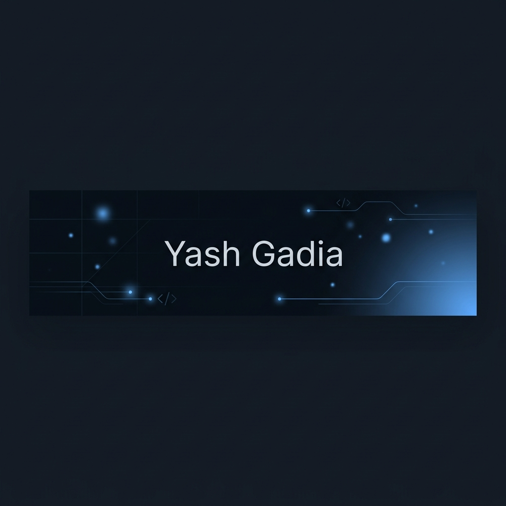

<div align="center">



<a href="https://yashgadia.vercel.app">
  
</a>

<br/>

[](https://yashgadia.vercel.app)&nbsp;
[](https://linkedin.com/in/yashgadia)&nbsp;
[](mailto:yash113gadia@gmail.com)
<br/>


</div>

---

```ts
// ~/about.ts
const yash = {
    education: "B.Tech + M.Tech CS — NIET, Greater Noida (2024–29)",
    roles    : ["Full-stack Developer", "Co-founder @ Qlaa", "Web Dev Intern @ SpeedoExpress"],
    building : "production-grade web apps & AI-powered tools",
    interests: ["distributed systems", "machine learning", "web3"],
};
```

---

<div align="center">

### `⚡ tech stack`

<br/>


</div>

---

### `🚀 projects`

**[codepilot](https://github.com/yash113gadia/codepilot)** &nbsp;·&nbsp; AI coding agent for the terminal. Supports Anthropic, OpenAI, Google, and local Ollama models.
<br/>`typescript` `cli` `ai`

**[attestr](https://github.com/yash113gadia/attestr)** &nbsp;·&nbsp; Decentralized media authenticator — steganographic watermarking with Ethereum blockchain verification.
<br/>`solidity` `web3` `react`

**[fittrack](https://github.com/yash113gadia/FitTrack)** &nbsp;·&nbsp; AI nutrition tracker with barcode scanning, photo analysis, and Gemini-powered dietary advice.
<br/>`react-native` `expo` `ai`

**[syllabusai](https://github.com/yash113gadia/SyllabusAI)** &nbsp;·&nbsp; Paste a syllabus, get a personalised AI study plan with daily schedules.
<br/>`typescript` `ai` `edtech`

**[attendease](https://github.com/yash113gadia/AttendEase-Web)** &nbsp;·&nbsp; Real-time attendance tracking for colleges. Teachers mark attendance live; students see updates instantly.
<br/>`react` `node` `postgres`

**[portfolio](https://yashgadia.vercel.app)** &nbsp;·&nbsp; 3D animated personal site with custom cursor and scroll-driven animations. [](https://yashgadia.vercel.app)
<br/>`three.js` `react` `animation`

---

### `📊 stats`

<div align="center">


&nbsp;


<br/>


<br/>
<br/>


</div>


